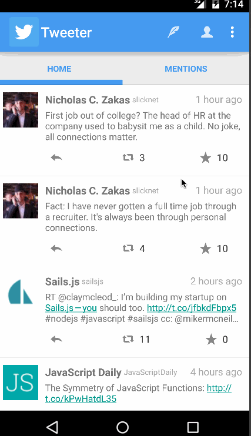

CodePath Android Project 3 - Twitter Client
=====================

This is a Twitter client app built for the Android CodePath class.

Timespent: 10 hours

Completed user stories:

Part 1:
* [x] Required: User can sign in to Twitter using OAuth login
* [x] Required: User can view the tweets from their home timeline
* [x] Required: User should be displayed the username, name, and body for each tweet
* [x] Required: User should be displayed the relative timestamp for each tweet "8m", "7h"
* [x] Required: User can view more tweets as they scroll with infinite pagination
* [x] Optional: Links in tweets are clickable and will launch the web browser (see autolink)
* [x] Required: User can compose a new tweet
* [x] Required: User can click a “Compose” icon in the Action Bar on the top right
* [x] Required: User can then enter a new tweet and post this to twitter
* [x] Required: User is taken back to home timeline with new tweet visible in timeline
* [x] Optional: User can see a counter with total number of characters left for tweet

* [x] Advanced: User can refresh tweets timeline by pulling down to refresh (i.e pull-to-refresh)
* [x] Advanced: User can open the twitter app offline and see last loaded tweets
Tweets are persisted into sqlite and can be displayed from the local DB
* [x] Advanced: User can tap a tweet to display a "detailed" view of that tweet
* [ ] Advanced: User can select "reply" from detail view to respond to a tweet
* [x] Advanced: Improve the user interface and theme the app to feel "twitter branded"
* [ ] Bonus: User can see embedded image media within the tweet detail view
* [ ] Bonus: Compose activity is replaced with a modal overlay

Part 2:

* [x] Require: User can switch between Timeline and Mention views using tabs.
* [x] Require: User can view their home timeline tweets.
* [x] Require: User can view the recent mentions of their username.
* [x] Require: User can navigate to view their own profile
* [x] Require: User can see picture, tagline, # of followers, # of following, and tweets on their profile.
* [x] Require: User can click on the profile image in any tweet to see another user's profile.
* [x] Require: User can see picture, tagline, # of followers, # of following, and tweets of clicked user.
* [x] Require: Profile view should include that user's timeline
* [x] Optional: User can view following / followers list through the profile
* [x] Require: User can infinitely paginate any of these timelines (home, mentions, user) by scrolling to the bottom

* [ ] Advanced: Robust error handling, check if internet is available, handle error cases, network failures
* [x] Advanced: When a network request is sent, user sees an indeterminate progress indicator
* [x] Advanced: User can "reply" to any tweet on their home timeline
* [x] Advanced: User can click on a tweet to be taken to a "detail view" of that tweet
* [x] Advanced: User can take favorite (and unfavorite) or reweet actions on a tweet
* [x] Advanced: Improve the user interface and theme the app to feel twitter branded
* [ ] Advanced: User can search for tweets matching a particular query and see results
* [ ] Bonus: User can view their direct messages (or send new ones)

Walkthrough of all user stories:

